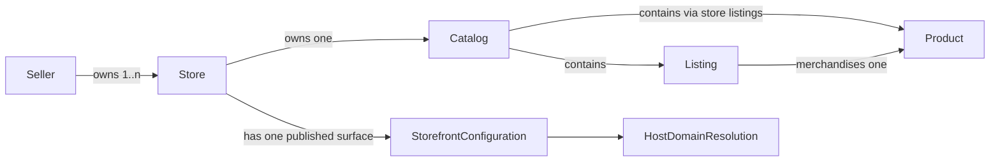
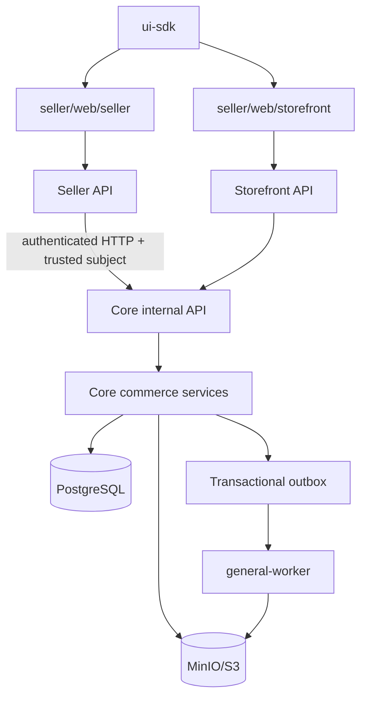
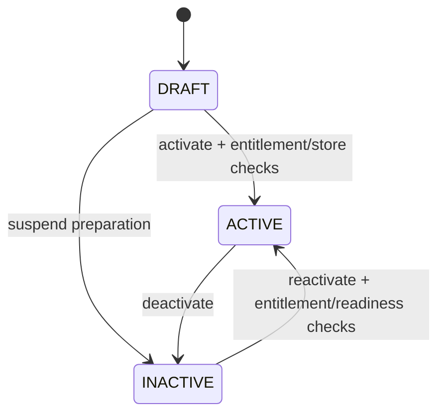
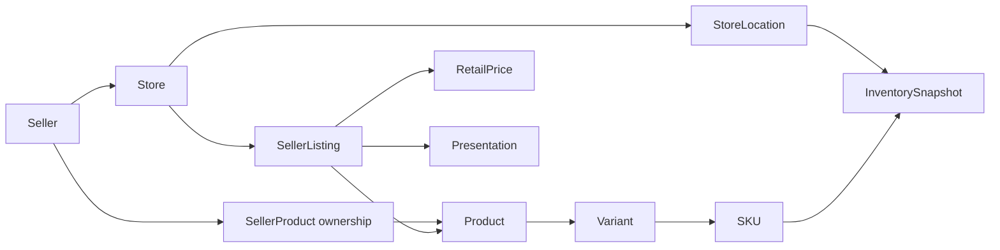
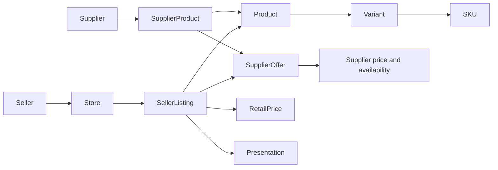
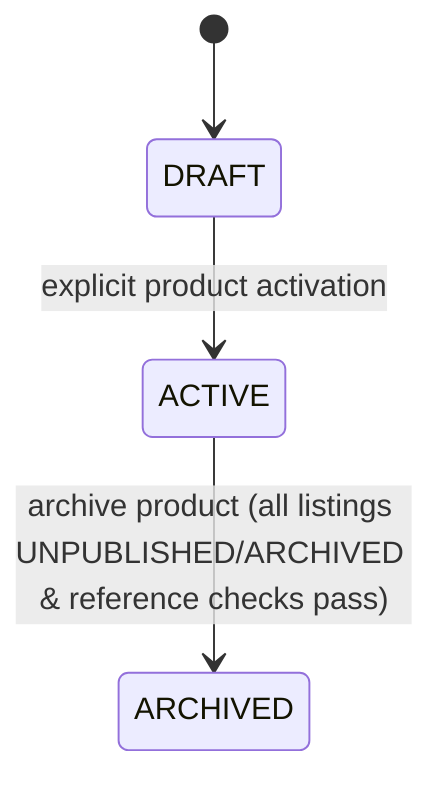
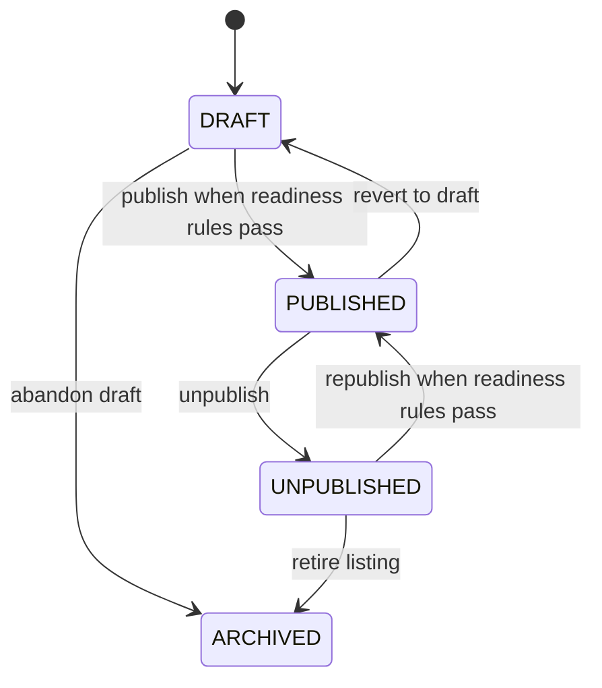
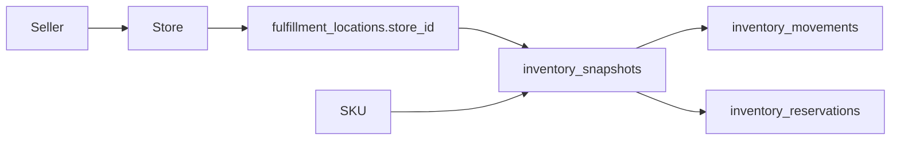
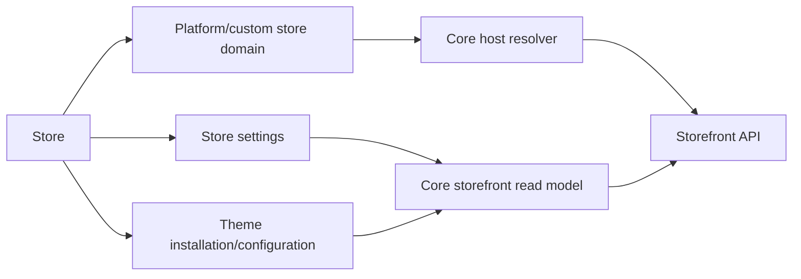
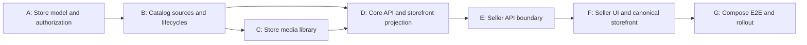

# Seller Catalog Operations Integration — Implementation Design and Plan

**Status:** Approved for implementation

**Date:** 2026-09-16

**Owners:** Core, Seller, Platform Infrastructure

**Primary boundary:** Core owns catalog state and invariants; Seller owns authenticated HTTP presentation and the seller-facing web experience.

## 1. Outcome

Deliver one production path for a seller to select an owned store and operate its catalog end to end:

1. create or import a product into a store;
2. manage variants and SKUs;
3. upload or reuse store-owned media;
4. set retail price, presentation, and inventory;
5. evaluate readiness and publish or unpublish a listing; and
6. observe the published result in the canonical storefront.

Every operation is explicitly store-scoped. A seller may own multiple stores, while Core enforces a configurable entitlement whose default permits one active store. The implementation extends the existing Core `/internal/v1` API and Seller `/v1/seller` API rather than creating another business backend.

The canonical customer storefront remains `seller/web/storefront`. The older mock storefront under `seller/web/seller/app/store/[slug]` is deprecated and removed after equivalent navigation is directed to the canonical storefront.

## 2. Current Baseline

The repository already provides these foundations, which this plan must extend rather than duplicate:

- Core stores, seller membership, store domains, seller-owned products, variants, SKUs, seller listings, listing prices, inventory snapshots, structured listing presentation, publish readiness, publish/unpublish transactions, and storefront revision invalidation.
- Core internal store routes under `/internal/v1/stores/{storeID}/...` and service authentication using `Authorization`, `X-Matjero-Service`, and `X-Matjero-Subject`.
- Seller API catalog operations under `/v1/seller/stores/{store_id}/...`, plus legacy query-scoped catalog and listing routes.
- A presigned S3-compatible upload flow backed by product-scoped `media_metadata` and `media_upload_intents`.
- Seller roles `seller_owner`, `seller_manager`, and `seller_staff`, with active seller membership stored in Core.
- The canonical multi-tenant storefront in `seller/web/storefront` and a separate mock storefront inside `seller/web/seller`.
- Local Postgres, Redis, RabbitMQ, ZITADEL, MinIO, Core, Seller API/web, and Storefront API/web services in `platform-infra/docker-compose.yml`.

The current media implementation is not the target library: an object belongs directly to one product, deduplication is by storage key rather than content checksum, and deleting product media can immediately delete the object. The new model separates immutable store assets from their reusable product references.

## 3. Scope

### Included

- Core `StoreEntitlementPolicy`, configured with a default active-store limit of `1`.
- Multiple owned stores in the data model and Seller store switcher.
- Explicit store scope in Seller page URLs and Seller API routes.
- A Core-owned, store-scoped, immutable media library with per-store SHA-256 deduplication, reusable references, safe deletion, and a presigned MinIO/S3 flow.
- Seller-owned product authoring, variants, SKUs, listing price and presentation, inventory, readiness, publish, and unpublish.
- Supplier-offer discovery, idempotent import, store-specific merchandising, readiness, publish, unpublish, and withdrawal behavior.
- Role and resource authorization at both the Seller boundary and Core business boundary.
- Seller and Core OpenAPI contract updates.
- Canonical storefront verification and removal of the duplicate mock storefront.
- Docker Compose end-to-end verification against real Core, Postgres, and MinIO services.

### Excluded

- Billing, subscription charging, invoicing, plan checkout, and payment-provider work.
- Customer payments, seller settlement, marketplace financial allocation, and ledger changes.
- Fulfillment, shipment, carrier, warehouse-routing, and order-lifecycle changes.
- Kubernetes manifests, Helm charts, operators, or cluster deployment design.
- Image transformation, transcoding, virus scanning, CDN provisioning, and DAM-style folders/tags.
- External seller-channel connectors in `seller-hub`.
- Supplier product-authoring changes; this plan only consumes existing eligible supplier offers.

The active-store limit is an entitlement check, not billing logic. This phase configures the limit but does not sell or charge for a higher limit.

## 4. Architecture and Ownership

```text
Seller browser
  -> seller/web/seller
  -> Seller API /v1/seller/stores/{store_id}/...
       - validates OIDC session and coarse role
       - forwards only trusted subject context
  -> Core /internal/v1/stores/{storeID}/...
       - resolves active seller member from subject
       - verifies store ownership and operation permission
       - applies entitlement and catalog invariants
       - persists PostgreSQL state and outbox work
  -> MinIO/S3
       - browser uploads through a short-lived presigned PUT
       - Core verifies the completed object and owns deletion

Customer browser
  -> seller/web/storefront (canonical)
  -> Storefront API
  -> Core storefront read model
```

Core is the only component allowed to decide whether a store can activate, an offer can be imported, an asset can be attached or deleted, or a listing can publish. Seller API performs transport validation and early role denial, but it never recreates Core business rules. Seller web does not call Core or MinIO credentials directly; it calls Seller API and uses only the returned presigned URL and required headers.

No new calls are introduced from Seller to the Core database. No Core Go packages are imported into Seller. Contract DTOs remain separately owned on each side of the HTTP boundary.

### 4.1 Mandatory commerce model

The implementation must preserve this hierarchy:



`Catalog` is the store-scoped operational view formed from listings; it is not a new independently owned product database. These identities are mandatory:

- `Product != Store`: a product describes sellable facts and variants; it does not own tenant settings, domains, or lifecycle.
- `Product != Listing`: a product is the reusable catalog subject; a listing is one store's merchant decision to sell that product.
- `Store != Product`: a store owns listings, media assets, configuration, domains, and seller inventory locations; it is never represented by a product record.
- A product enters a store catalog only through a listing for that store. Product ownership by a seller does not silently place that product in every store owned by the seller.
- Listing identity, price, presentation, source, publish state, and storefront eligibility are store-specific even when two stores refer to the same product.

The required navigation and API model is therefore `Seller -> Stores -> selected Store -> Catalog -> Products/Listings`. The store switcher changes the selected store context; it does not change or impersonate a seller.

### 4.2 Dependency direction



Dependencies flow toward Core business capabilities. Seller API does not own catalog persistence, Seller web does not call Core directly, and the canonical storefront does not import authoring code.

## 5. Store Entitlement and Store Selection

### 5.1 Core policy

Add a Core `StoreEntitlementPolicy` dependency to the commerce service. Its initial implementation has one configuration value, `DefaultMaxActiveStores`, loaded from `STORE_DEFAULT_MAX_ACTIVE_STORES` with a default of `1`; startup rejects values below `1`.

The policy answers only whether a seller may transition a store into `ACTIVE`. It counts active stores for the seller in the same transaction that locks the seller's store set and changes status. Creation with `status=active` and later activation use this same primitive. `DRAFT` and `INACTIVE` stores do not consume entitlement capacity: a seller may own any number of them and prepare another store without bypassing the active-store limit.

The design supports multi-store without schema coupling to a pricing plan: raising the configured value permits more simultaneously active stores. A later billing project may provide a different policy implementation, but this phase does not add plan tables or billing calls.

Required behavior:

- The default configuration permits one active store per seller.
- Re-saving an already active store is idempotent and does not consume another slot.
- Deactivating one store releases a slot.
- Concurrent activations cannot exceed the limit; the transaction locks the seller row or uses an equivalent per-seller advisory lock before counting.
- Admin moderation may force a store inactive, but activation still goes through the policy.
- An entitlement denial returns `409 store_entitlement_exceeded` and includes no information about another seller.
- Supplier-retail stores use the same seller-backed policy because they are persisted as stores owned by the affiliated seller.

The policy must not limit total store rows, draft stores, inactive stores, products, listings, media, or traffic. `DefaultMaxActiveStores=1` means exactly one simultaneously active store by default, not one lifetime store.

### 5.2 Store lifecycle

The normative business states are `DRAFT`, `ACTIVE`, and `INACTIVE`. To remain compatible with current Core conventions, persisted and wire values are lowercase (`draft`, `active`, `inactive`); the uppercase names below describe the state machine.



There is no transition back to `DRAFT`, and physical store deletion is outside this plan. Creation defaults to `DRAFT`; a request to create directly as `ACTIVE` is permitted only for an owner and runs the same entitlement, seller-status, and market-validity checks as later activation. Listing publish readiness is separate and is not a store-transition rule.

Authorization and transition rules:

| Transition | Seller owner | Seller manager/staff | Platform admin | Entitlement check |
|---|---:|---:|---:|---:|
| create `DRAFT` | yes | no | administrative provisioning only | no |
| `DRAFT -> ACTIVE` | yes | no | permitted for support, never bypasses policy | yes |
| `DRAFT -> INACTIVE` | yes | no | yes | no |
| `ACTIVE -> INACTIVE` | yes | no | yes, including moderation | no |
| `INACTIVE -> ACTIVE` | yes | no | permitted for support, never bypasses policy | yes |
| same-state retry | yes when normally authorized | no | yes | no additional slot |

An `INACTIVE` store remains authorable by authorized seller members but is not publicly resolvable. A `DRAFT` store is authorable but cannot publish listings. An `ACTIVE` store may resolve publicly only through a valid active domain and otherwise valid storefront configuration.

### 5.3 Store collection and switcher

`GET /v1/seller/stores` remains the switcher source. Extend its response to include `active_store_limit` and `active_store_count` alongside `items`, so the UI can explain why activation or creation-as-active is unavailable. Core computes these values; Seller does not infer them.

The switcher stores only a convenience preference in a cookie or local storage. It is never authorization input. The selected store is always present in the route, and Core re-authorizes it on every request. Selection rules are deterministic:

1. keep the route's store when it is still in the returned owned-store list;
2. otherwise select the first active store ordered by creation time and ID;
3. otherwise select the first owned store; and
4. show onboarding when the seller owns no store.

Target Seller page routes are:

```text
/dashboard/stores/{store_id}
/dashboard/stores/{store_id}/catalog/products
/dashboard/stores/{store_id}/catalog/products/new
/dashboard/stores/{store_id}/catalog/products/{product_id}
/dashboard/stores/{store_id}/catalog/supplier-offers
/dashboard/stores/{store_id}/catalog/listings
/dashboard/stores/{store_id}/catalog/listings/{listing_id}
/dashboard/stores/{store_id}/inventory
/dashboard/stores/{store_id}/media
/dashboard/stores/{store_id}/storefront
```

Existing unscoped dashboard links such as `/dashboard/catalog/products` become redirects that choose a store by the rules above. They do not remain independent feature routes.

## 6. Authorization Model

Authentication and authorization are separate layers:

- Seller API validates the end-user token and requires one of the existing seller roles.
- Seller API forwards the verified subject over its authenticated service connection.
- Core resolves the active `seller_members` record, checks the member's persisted role, resolves the store from the path, and verifies that the store belongs to that seller.
- Cross-seller identifiers return `404 not_found`, preventing tenant enumeration.

The Core membership role, not a forwarded browser role header, is authoritative for business permission. Do not add a client-settable role header.

| Capability | owner | manager | staff |
|---|---:|---:|---:|
| View stores, products, listings, media, inventory, readiness | yes | yes | yes |
| Create/edit products, variants, SKUs, media references, prices, presentation | yes | yes | no |
| Adjust inventory | yes | yes | yes |
| Import supplier offer | yes | yes | no |
| Publish/unpublish listing | yes | yes | no |
| Create store or change store status | yes | no | no |
| Permanently delete an unreferenced media asset | yes | yes | no |

Seller API applies the same matrix for fast rejection and UI capability flags, while Core repeats the decisive check from persisted membership. A missing or inactive member returns `403 forbidden`; a valid member requesting another seller's store receives `404 not_found`.

All mutations write the authenticated subject and request correlation ID to existing audit/event fields where available. Media deletion jobs also record the requesting subject.

## 7. Core Data Model

Use a forward-only migration after the current migration set. Final migration numbering is chosen at implementation time from the repository head.

### 7.1 Product source graphs and unified catalog

The store catalog is one list and one search surface containing both source types. Every catalog row has a `source` discriminator (`seller_owned` or `supplier_backed`) and the same store-scoped listing envelope. Source changes editing rights and readiness rules; it does not split the UI into unrelated catalogs.

Seller-owned source graph:



The seller owns and may author product facts through `seller_products`. A store listing selects that product for one store. The same seller-owned product may be deliberately listed in another owned store, but only through a separate listing and store-specific merchandising.

Supplier-backed source graph:



The supplier remains owner of supplier product facts, variants, SKUs, offer price, offer availability, and supplier inventory. Those facts are protected and read-only to the seller. The seller remains the merchant for the customer-facing listing: the seller chooses whether to import/publish, owns the retail price and presentation, receives the customer order through its store, and cannot rewrite supplier-owned source facts.

Supplier import uses reference semantics, not a hidden product copy:

| Data | Import behavior | Later source changes |
|---|---|---|
| `product_id`, variants, SKUs | referenced from the supplier product graph | current eligible facts are read at authoring/readiness time |
| `supplier_offer_id`, supplier price/availability/inventory | referenced | eligibility is rechecked at publish and storefront read time |
| `store_id`, source, market, import identity | persisted on the seller listing | immutable except explicit archival lifecycle |
| seller retail price, presentation, media references, publish state | created and owned by the seller/store listing | seller-editable under role rules |
| customer order line title, SKU code, retail price, supplier cost/source linkage | snapshotted by the existing checkout/order flow | historical orders do not drift when catalog facts change |

No supplier product, variant, or SKU is copied into a new seller-owned product during import. If future requirements need a seller-editable fork, that is an explicit copy-product capability outside this integration.

### 7.2 Media assets

Create `store_media_assets`:

| Column | Contract |
|---|---|
| `id` | UUID primary key |
| `store_id` | required FK to `stores`, delete restricted |
| `checksum_sha256` | lowercase 64-character hex digest of verified bytes |
| `storage_key` | immutable object key, unique |
| `content_type` | verified allowlisted MIME type |
| `byte_size` | verified positive size |
| `original_filename` | sanitized display metadata, never part of the object key |
| `status` | `ready`, `deleting`, or `deleted` |
| `created_by_subject` | audit subject |
| timestamps | creation and lifecycle timestamps |

Content fields are immutable after the asset becomes `ready`. Only lifecycle status and deletion timestamps may change. A partial unique index on `(store_id, checksum_sha256)` for `ready` and `deleting` rows enforces per-store deduplication. The same bytes in different stores produce separate rows and keys; deduplication never crosses a tenant boundary.

Create `product_media_references`:

| Column | Contract |
|---|---|
| `id` | UUID primary key; this is the media ID used by presentation sections |
| `store_id` | required FK used for tenant checks and indexes |
| `product_id` | required FK to product |
| `asset_id` | required FK to `store_media_assets`, delete restricted |
| `alt_text` | reference-specific localized/display text |
| `sort_order` | reference ordering |
| `is_primary` | reference-specific primary flag |
| timestamps | mutable reference timestamps |

Enforce one reference for `(store_id, product_id, asset_id)` and at most one primary reference per `(store_id, product_id)`. A constraint trigger or transaction-level validation must prove that the asset and listing/product context belong to the same store. The public storefront projects the reference ID, resolved asset URI, alt text, ordering, and primary flag; it never exposes storage keys or checksums.

Evolve `media_upload_intents` to bind `store_id`, a client-generated upload request ID, request fingerprint, expected SHA-256, expected size, content type, storage key, token digest, expiry, and completion. An intent does not count as a reusable asset until completion verifies the object.

Backfill existing product media only when its store ownership is unambiguous from a seller listing. Rows that cannot be mapped safely fail the migration before destructive changes. Create an asset and reference for each legacy row, preserving media IDs used by structured presentation. Delay removal of legacy columns/tables until the new read path and backfill checks pass; no dual-write period extends beyond this integration.

### 7.3 Product and listing lifecycles

Keep `seller_listings` as the store-specific sellable aggregate for both sources:

- `supplier_offer_id IS NULL` means `seller_owned` and requires the product's `seller_products` owner to match the store's seller.
- `supplier_offer_id IS NOT NULL` means `supplier_backed` and requires product, offer, and store market consistency.

Add only the indexes or import-idempotency constraint needed to guarantee one canonical listing per `(store_id, product_id)` and one imported occurrence of `(store_id, supplier_offer_id)`. Existing duplicates, if any, must be detected and resolved explicitly before the unique index is installed.

Do not copy supplier products, variants, or SKUs into seller-owned rows during import. Store-specific price, presentation, status, and optional store-media references belong to the listing. Supplier-owned product facts remain read-only to the seller.

Product and listing state are independent. Publishing a listing must not be modeled as making a store itself into a product, and unpublishing one store's listing must not hide another store's listing for the same product.

Seller-owned product lifecycle:



- `DRAFT`: seller-owned product facts may be edited; no listing for it is publicly visible.
- `ACTIVE`: product facts are activated and eligible to support listings. Product lifecycle is exactly `DRAFT -> ACTIVE -> ARCHIVED`, independent of Listing publication.
- `ARCHIVED`: terminal for seller operations; no new variants, SKUs, listings, or media references may be added.
- Supplier-backed products follow the existing supplier-controlled `active`/`inactive` product and supplier-product eligibility; a seller cannot transition or archive them.
- Product archive behavior: Core rejects Product archival while any Store Listing associated with that product is `PUBLISHED`. Core does not silently mutate listings. Each listing must first be independently transitioned to `UNPUBLISHED` (via listing unpublish operation) and then `ARCHIVED` (via listing archive operation) through authorized operations. Once all listings for the product across stores are in `UNPUBLISHED` or `ARCHIVED` states and protected-reference rules (e.g., orders, carts, inventory snapshots, media references) pass, the Product may transition to `ARCHIVED`.
- Retain archived Product and Listings in the database for historical context and audit; ordinary hard-deletion is never performed. Physical cleanup, if ever required, is a separate retention project.

Listing lifecycle:



- `DRAFT`: authorable, never returned by the public storefront.
- `PUBLISHED`: publicly eligible only while store, product, source, price, media, inventory, and presentation readiness checks continue to pass.
- `UNPUBLISHED`: intentionally hidden but retains merchandising state and may be republished after readiness revalidation.
- `ARCHIVED`: terminal and hidden; retained for references/audit. It cannot publish again.
- Transition rule: Listing lifecycle is exactly `DRAFT <-> PUBLISHED <-> UNPUBLISHED -> ARCHIVED` with readiness rules. Direct transition `PUBLISHED -> ARCHIVED` is invalid; each listing must first be independently transitioned to `UNPUBLISHED` (or reverted to `DRAFT`) and then `ARCHIVED`.

Persisted/wire values are lowercase. Existing seller-owned `products.status='inactive'` rows map to product `draft`; active seller products remain `active`; `archived` is new. Product activation (`draft -> active`) is explicit and independent of listing publication. Supplier-owned product eligibility retains its supplier-controlled `active`/`inactive` values and is not rewritten into a seller authoring state. Existing `active`/`inactive` listing rows require a migration mapping with preflight counts: `active -> published`, authoring-time `inactive -> draft`, and previously live `inactive -> unpublished` only where the migration can prove prior publication. Ambiguous rows must be reported and resolved before the constraint is installed; the migration must not guess.

## 8. Immutable Media Library and MinIO Flow

### 8.1 Browse and reuse

`GET /internal/v1/stores/{storeID}/media` lists only `ready` assets for the authorized store, with pagination and optional filename/content-type query filters. `POST /internal/v1/stores/{storeID}/products/{productID}/media-references` attaches an existing asset to an eligible product/listing in that store. Attaching reuses bytes without copying an object.

Alt text, sort order, and primary selection are properties of the reference and may be edited. Asset checksum, bytes, MIME type, object key, and owning store cannot be edited.

Ownership is explicit at both layers:

- The store owns the immutable binary asset. Even two stores owned by the same seller cannot attach, discover, or deduplicate against each other's asset.
- The store-specific product/listing context owns each mutable media reference. A reference may point only to an asset with the same `store_id`.
- Supplier media, if exposed by the supplier catalog, remains supplier-owned source media. Import does not transfer its binary ownership. A seller that needs its own reusable copy must ingest it as a new store asset through the normal verified upload flow; the implementation must not perform an implicit cross-tenant copy.
- Removing a product/listing reference does not transfer or destroy the underlying store asset.

### 8.2 Presign

The browser computes SHA-256 and sends:

```json
{
  "client_upload_id": "<client-generated UUID>",
  "filename": "front.webp",
  "content_type": "image/webp",
  "size_bytes": 184321,
  "checksum_sha256": "<64 lowercase hex characters>"
}
```

Core validates the MIME allowlist, positive size and configured maximum, checksum shape, and store permission. Product/listing eligibility is checked later when a ready asset is attached as a reference. The authoritative maximum is the existing Core `MEDIA_UPLOAD_MAX_BYTES`/`MediaUploadMaxBytes` configuration, not the current hard-coded 10 MiB service check; Core returns the effective maximum in bootstrap/capability metadata so Seller web can reject oversized files early without becoming authoritative. It then checks the per-store checksum index:

- If a `ready` asset exists, return `200` with `mode: "reuse"` and the asset. No upload URL is issued.
- If the same client upload request ID and fingerprint already has an unexpired intent, return that intent's identity with a newly presigned PUT and newly rotated completion token; changed input for that request ID returns `409 idempotency_conflict`.
- If another request ID has an unexpired intent for the same store and checksum, return `409 upload_in_progress` so clients do not race duplicate uploads.
- Otherwise create an intent and return `201` with `mode: "upload"`, a short-lived presigned PUT URL, opaque completion token, storage key, expiry, and the exact required request headers.

The storage key is generated by Core and includes the store ID plus random material; it never uses the raw filename. The bucket stays private. Normal media delivery uses the configured public/CDN base URL or a separate read policy, not the Seller API.

### 8.3 Upload and completion

The browser PUTs directly to MinIO with the signed content type and checksum header. It then posts the storage key and opaque completion token to the completion endpoint.

Core completion:

1. loads the intent by path ID and validates store, subject, expiry, completion token, request fingerprint, and single-use state;
2. performs `HeadObject` and validates existence, size, and content type;
3. reads the bounded object once from MinIO and computes SHA-256 over the actual bytes; a client-provided metadata value alone is not trusted;
4. rejects and schedules deletion when the digest or size differs;
5. in one database transaction, inserts the immutable store asset and marks the intent complete;
6. on a concurrent checksum conflict, reuses the winning store asset and schedules the losing object for deletion; and
7. returns the asset. The caller attaches it through the separate media-reference endpoint. Repeating completion with the same intent and completion fingerprint returns the same asset; a changed replay returns `409 idempotency_conflict`.

This one verification read is part of upload ingestion; Core still does not proxy routine storefront media delivery.

### 8.4 Safe detach and deletion

Deleting product media means deleting a reference, not immediately deleting the asset. If the removed reference was primary, the transaction promotes the lowest `(sort_order, id)` remaining reference. Publish readiness is recalculated from remaining references.

Permanent library deletion is a separate `DELETE /stores/{storeID}/media/{assetID}` operation:

1. lock the asset row;
2. reject with `409 media_in_use` when any product reference exists;
3. atomically change `ready -> deleting` and enqueue an outbox-backed deletion job;
4. return `202`;
5. the existing general-worker process deletes the MinIO object idempotently and marks the row `deleted`; and
6. retry transient storage failures without returning the asset to `ready` or allowing new references.

`404` from object storage is treated as successful deletion. A `deleting` or `deleted` asset cannot be attached. Tombstones retain audit metadata but are omitted from normal list responses. A partial checksum uniqueness rule permits a fresh asset after the prior row reaches `deleted`.

Expired or failed upload intents and their orphan objects are cleaned by the same worker path. Do not use an untracked best-effort delete after removing the database row.

## 9. Catalog Lifecycles

### 9.1 Seller-owned product

1. `POST /stores/{storeID}/products` atomically creates the global product, seller ownership row, and draft store listing.
2. The seller edits translations/categories and creates variants and SKUs.
3. The seller uploads or reuses store media and attaches references.
4. The seller creates a store fulfillment location if needed and creates/adjusts inventory snapshots for active SKUs.
5. Product status transition (`DRAFT -> ACTIVE`) is explicit and independent of listing publication.
6. The seller sets the listing price and presentation.
7. `GET /stores/{storeID}/listings/{listingID}/readiness` returns structured blocking codes plus display-safe messages.
8. `POST /stores/{storeID}/listings/{listingID}/publish` repeats authoritative readiness checks inside a locking transaction, transitions only this listing from `DRAFT` or `UNPUBLISHED` to `PUBLISHED`, and bumps the storefront revision.
9. Unpublish (`POST /stores/{storeID}/listings/{listingID}/unpublish`) transitions only this listing from `PUBLISHED` to `UNPUBLISHED` and bumps the revision without deleting authoring state or deactivating the shared product.
10. Listing archival (`POST /stores/{storeID}/listings/{listingID}/archive`) transitions a listing from `UNPUBLISHED` or `DRAFT` to `ARCHIVED`. Listing archival is rejected if the listing is currently `PUBLISHED` (must unpublish first).
11. Product archival (`POST /stores/{storeID}/products/{productID}/archive`) transitions a product from `ACTIVE` to `ARCHIVED`. Core rejects product archival while any Store Listing for that product is `PUBLISHED`. Core never silently mutates listings. Each listing must first be independently transitioned to `UNPUBLISHED` and then `ARCHIVED` through authorized operations. Once all listings for the product are in `UNPUBLISHED` or `ARCHIVED` states and protected-reference rules pass, the product may transition to `ARCHIVED`. Archived Product and Listings are retained for history and never hard-deleted.

Variants and SKUs remain product resources but are reachable only beneath the store and product that authorize them. IDs from another product or store return `404`.

### 9.2 Supplier-offer import

1. `GET /stores/{storeID}/supplier-offers` returns only active, available offers in the store market. It supports supplier, category, query, limit, and offset filters.
2. `POST /stores/{storeID}/supplier-offers/{offerID}/imports` validates offer/product/market consistency and creates one draft seller listing. Repeating the request returns the existing listing rather than duplicating it.
3. Supplier product facts, variants, and SKUs are read-only. The seller may set the store retail price, listing presentation, and store-specific media references without modifying the supplier's product.
4. Readiness requires an active store, eligible active offer, available supplier inventory, current supplier price where required by sourcing, current seller retail price in the store currency, at least one display media reference (store-specific or eligible supplier media), valid presentation, and at least one active/selectable supplier SKU.
5. Publishing activates only the seller listing, then bumps the storefront revision. It does not change supplier product or offer status.
6. If an offer becomes inactive, unavailable, market-incompatible, or loses sellable supplier inventory, storefront eligibility fails closed even before asynchronous cleanup. An event-driven projection may also mark the listing unavailable and bump the revision, but correctness must not depend on event timing.
7. Unpublish preserves the import and merchandising state. A separate remove-import operation is not part of this phase.

The unified listing publish contract replaces product-specific publish as the preferred contract. Existing product publish/unpublish endpoints remain as temporary compatibility shims for seller-owned products, delegate to the listing service, are marked deprecated in OpenAPI, and are removed only after Seller web no longer calls them.

### 9.3 Existing inventory scope — preserve, do not redesign

The current inventory model is authoritative for this integration:



- Seller ownership is indirect: `Seller -> Store -> seller-owned fulfillment location`.
- A seller-owned fulfillment location has `store_id` set and `supplier_id`/`supplier_market_id` null. Database ownership checks keep seller and supplier location branches mutually exclusive.
- An inventory snapshot is scoped by the unique pair `(fulfillment_location_id, sku_id)`; it intentionally has no duplicate seller or store column.
- The Seller service verifies that the location belongs to the route store and that the SKU belongs to the seller-owned product before creating or adjusting a store snapshot.
- Adjustments change `on_hand_qty`, increment `version`, never directly mutate `reserved_qty`, refuse reductions below reserved quantity, append an `inventory_movements` audit row, and bump affected storefront revisions.
- `principal_subject`, `correlation_id`, and `causation_id` on movements are audit/trace data. They are not currently a uniqueness or retry guarantee.
- Supplier-backed listings consume supplier offer availability and supplier-owned inventory eligibility. Import does not create seller/store inventory snapshots for supplier SKUs and does not grant the seller permission to adjust supplier locations.

This project adds the missing idempotency identity/fingerprint to seller inventory adjustment but does not replace snapshots, locations, reservations, movements, versioning, or source-specific inventory ownership.

### 9.4 Storefront configuration and host resolution



`Store -> Storefront configuration -> host/domain resolution` is the only public path. Store settings and the published theme configuration define presentation behavior. Core resolves the trusted storefront host to an active primary platform/custom domain and an `ACTIVE` store; Seller or browser-supplied store IDs do not select a public tenant. Publish/unpublish and published theme changes bump the store's storefront revision. Domain activation/deactivation uses the existing host-resolution safety checks so stale cache generations cannot make an inactive or unknown host public.

## 10. API Contracts

All routes below are target contracts. Routes already present keep compatible response fields unless this plan explicitly marks them deprecated.

### 10.1 Core internal API

| Method and path | Purpose | Roles |
|---|---|---|
| `GET /internal/v1/sellers/{sellerID}/stores` | owned stores plus entitlement summary | owner, manager, staff |
| `POST /internal/v1/sellers/{sellerID}/stores` | create store; active creation uses entitlement policy | owner |
| `POST /internal/v1/stores/{storeID}/status` | seller store status transition through policy | owner |
| `GET /internal/v1/stores/{storeID}/products` | list store catalog across both sources | owner, manager, staff |
| `POST /internal/v1/stores/{storeID}/products` | create seller-owned draft product/listing | owner, manager |
| `POST /internal/v1/stores/{storeID}/products/{productID}/status` | explicit product status transition (`draft -> active`) independent of listing publication | owner, manager |
| `POST /internal/v1/stores/{storeID}/products/{productID}/archive` | archive seller-owned product (rejected while any listing is `PUBLISHED` or protected references remain) | owner, manager |
| existing nested variant/SKU routes | author seller-owned variants/SKUs | owner, manager |
| `GET /internal/v1/stores/{storeID}/supplier-offers` | browse eligible supplier offers | owner, manager, staff |
| `POST /internal/v1/stores/{storeID}/supplier-offers/{offerID}/imports` | idempotently create supplier-backed draft listing | owner, manager |
| `GET /internal/v1/stores/{storeID}/listings` | list store listings | owner, manager, staff |
| `GET /internal/v1/stores/{storeID}/listings/{listingID}` | source-aware authoring detail | owner, manager, staff |
| `PUT /internal/v1/stores/{storeID}/listings/{listingID}/price` | replace current retail price | owner, manager |
| existing presentation GET/PUT routes | read/update structured presentation | read all; write owner/manager |
| `GET /internal/v1/stores/{storeID}/listings/{listingID}/readiness` | structured readiness | owner, manager, staff |
| `POST /internal/v1/stores/{storeID}/listings/{listingID}/publish` | atomic source-aware publish | owner, manager |
| `POST /internal/v1/stores/{storeID}/listings/{listingID}/unpublish` | atomic unpublish | owner, manager |
| `POST /internal/v1/stores/{storeID}/listings/{listingID}/archive` | archive draft/unpublished listing (rejected if listing is `PUBLISHED`) | owner, manager |
| `GET /internal/v1/stores/{storeID}/media` | list ready store assets | owner, manager, staff |
| `POST /internal/v1/stores/{storeID}/media/uploads` | dedup lookup or presign | owner, manager |
| `POST /internal/v1/stores/{storeID}/media/uploads/{intentID}/complete` | verify object and create/reuse asset | owner, manager |
| `DELETE /internal/v1/stores/{storeID}/media/{assetID}` | enqueue safe permanent deletion | owner, manager |
| `POST /internal/v1/stores/{storeID}/products/{productID}/media-references` | attach reusable asset | owner, manager |
| `PUT /internal/v1/stores/{storeID}/products/{productID}/media-references/{referenceID}` | edit reference metadata | owner, manager |
| `DELETE /internal/v1/stores/{storeID}/products/{productID}/media-references/{referenceID}` | detach asset | owner, manager |
| existing store inventory routes | list/snapshot/adjust existing store/SKU/location inventory; adjustment requires idempotency identity | read all; adjust all roles |

For listing price, presentation, publish, and media reference routes, Core verifies that `{listingID}`, `{productID}`, `{assetID}`, and nested IDs all resolve within `{storeID}`. Body fields cannot override path scope.

### 10.2 Seller public API boundary

Seller exposes the same resource hierarchy under `/v1/seller` and maps DTOs explicitly. The browser never receives Core service credentials, upload token digests, raw storage errors, storage keys after completion, supplier cost, or internal inventory reservation fields. Seller forwards operation-specific idempotency identities and request fingerprints through its typed Core client; it does not substitute correlation IDs.

Legacy routes are replaced as follows:

| Deprecated | Replacement |
|---|---|
| `GET /v1/seller/catalog/offers?store_id=...` | `GET /v1/seller/stores/{store_id}/supplier-offers` |
| `GET /v1/seller/listings?store_id=...` | `GET /v1/seller/stores/{store_id}/listings` |
| `POST /v1/seller/listings/import` with `store_id` in body | `POST /v1/seller/stores/{store_id}/supplier-offers/{offer_id}/imports` |
| `POST /v1/seller/listings/{id}/price` | `PUT /v1/seller/stores/{store_id}/listings/{listing_id}/price` |
| `POST /v1/seller/listings/{id}/status` | explicit store-scoped publish/unpublish endpoints |

Deprecated routes may remain for one compatibility release, but they must delegate to the store-scoped application service, emit deprecation metadata, and accept no wider authorization behavior. Seller web switches atomically to replacements before removal.

### 10.3 Response shapes

Readiness is machine-readable:

```json
{
  "is_ready": false,
  "reasons": [
    {"code": "retail_price_missing", "message": "Current retail price is required"},
    {"code": "media_missing", "message": "At least one product image is required"}
  ]
}
```

Media presign/reuse is a discriminated response:

```json
{
  "mode": "upload",
  "intent_id": "...",
  "upload_url": "...",
  "upload_token": "...",
  "required_headers": {
    "Content-Type": "image/webp",
    "x-amz-checksum-sha256": "..."
  },
  "expires_at": "..."
}
```

or:

```json
{
  "mode": "reuse",
  "asset": {
    "id": "...",
    "content_type": "image/webp",
    "byte_size": 184321,
    "url": "..."
  }
}
```

The reuse response intentionally omits another product's alt text and ordering because those belong to references.

## 11. Idempotency and Retry Contracts

MatjerHub does not currently have a universal idempotency middleware or an `Idempotency-Key` table. Existing safe-retry behavior is operation-specific and database-backed: stable resource/natural keys, unique constraints, row locks, terminal-state replay, and—for checkout finalization—a persisted request fingerprint that returns the original result for an identical replay and `idempotency_conflict` for changed input. `X-Request-Id` and `X-Correlation-Id` are observability values only and must never be treated as deduplication keys.

This integration follows that existing mechanism rather than introducing a second generic framework:

| Operation | Persistent idempotency identity | Same replay | Changed replay |
|---|---|---|---|
| supplier-offer import | unique `(store_id, supplier_offer_id)` plus canonical request fingerprint | return existing listing | `409 idempotency_conflict` if immutable import fields differ |
| media upload intent | unique `(store_id, client_upload_id)` plus checksum/size/MIME fingerprint | return same intent identity with refreshed presign and rotated completion token | `409 idempotency_conflict` |
| media completion | upload intent ID plus completion fingerprint; one completed asset result | return the completed asset | `409 idempotency_conflict` |
| publish | listing ID and target state `PUBLISHED` | return current published listing; do not bump revision or emit work twice | `422 publish_not_ready` when current state/readiness no longer supports publish |
| unpublish | listing ID and target state `UNPUBLISHED` | return current unpublished listing; do not bump revision twice | invalid terminal transition returns state conflict |
| inventory adjustment | unique `(inventory_snapshot_id, idempotency_key)` plus fingerprint of delta/reason | return the recorded movement and resulting snapshot | `409 idempotency_conflict` |

The Seller API requires a client-generated idempotency key for upload-intent creation and inventory adjustment, validates its bounded format, and forwards it to Core. Import and publish/unpublish use their stable resource identities and do not require an arbitrary extra key. Core stores fingerprints and response/resource references in the same transaction as the mutation. A process crash before commit is retryable; a crash after commit replays the committed result.

Inventory adjustment adds only idempotency metadata/indexing to the existing movement transaction. It does not use `correlation_id` as the key, and it does not apply the delta twice when a response is lost.

## 12. Errors and Concurrency

Extend the closed Core-to-Seller error vocabulary and map it consistently:

| Code | HTTP | Meaning |
|---|---:|---|
| `validation_error` | 400 | malformed field, unsupported MIME, invalid transition input |
| `unauthorized` | 401 | invalid service or end-user authentication |
| `forbidden` | 403 | authenticated member lacks the operation role |
| `not_found` | 404 | resource absent or outside the caller's seller/store scope |
| `conflict` | 409 | general uniqueness or state conflict |
| `idempotency_conflict` | 409 | a stable retry identity was reused with a different request fingerprint |
| `store_entitlement_exceeded` | 409 | active-store limit would be exceeded |
| `upload_in_progress` | 409 | same store/checksum already has a live intent |
| `checksum_mismatch` | 422 | uploaded bytes do not match the declared digest |
| `media_in_use` | 409 | permanent deletion requested while references exist |
| `publish_not_ready` | 422 | listing readiness failed; response includes structured reasons |
| `offer_unavailable` | 409 | supplier offer cannot be imported or published |
| `resource_in_use` | 409 | archive/delete-style request is unsafe because protected references remain or Product archival is attempted while a Store Listing is still PUBLISHED |
| `service_unavailable` | 503 | Core or object storage is unavailable |

Unexpected Core errors and MinIO details collapse to safe public messages. Logs may include correlation IDs and internal causes, but never service tokens, upload tokens, signed URLs, or object credentials.

Use database uniqueness and locks as the final concurrency authority:

- per-seller lock for active-store transitions;
- unique store/checksum index for asset deduplication;
- unique product/asset reference index;
- unique store/offer import index;
- row locks plus readiness re-evaluation for publish; and
- asset row lock for attach-versus-delete races.

Endpoints whose retries are expected follow the table above. Media attach uses its unique `(store_id, product_id, asset_id)` reference identity and returns the existing reference for an identical retry. Payload-changing retries against the same idempotency identity return `409 idempotency_conflict`.

## 13. Seller Web and Canonical Storefront

Implement the seller catalog UI only in `seller/web/seller` and customer rendering only in `seller/web/storefront`.

Frontend implementation must use the UI UX Pro Max workflow for UX decisions and must reuse/extend the existing `ui-sdk` for shared tokens, controls, navigation, accessibility behavior, and responsive patterns. Stitch is explicitly prohibited: do not use Stitch, import Stitch output, or create a Stitch-derived parallel component system. Repository conventions and `ui-sdk` remain the source of truth for production UI code.

Seller web work:

- load owned stores and entitlement summary after authentication;
- add a store switcher to the dashboard shell;
- move catalog navigation to `/dashboard/stores/{store_id}/...`;
- add source-aware product/listing views (`seller_owned` and `supplier_backed`);
- provide seller-owned product editing for translations, categories, variants, SKUs, media, price, inventory, and presentation;
- provide supplier-offer browsing/import and lock supplier-owned facts read-only;
- provide media-library upload/reuse, detach, and safe-delete states;
- show structured readiness reasons and role-aware actions; and
- link storefront preview/live navigation to the host returned by the existing store storefront-host endpoint.

Role-based hiding is usability only; APIs remain authoritative. Switching stores cancels in-flight queries, clears store-keyed client cache, and navigates to a route containing the new store ID. Query keys include store ID to prevent data from the prior store flashing in the new context.

Canonical storefront work is limited to consuming the final listing/media projection and proving that publish/unpublish and store revision changes appear correctly. Catalog authoring logic does not move into storefront code.

Deprecate the duplicate mock storefront by:

1. removing navigation and links to `/store/[slug]` from Seller web;
2. replacing any required local preview link with the canonical storefront host;
3. deleting `seller/web/seller/app/store/[slug]`, `seller/web/seller/components/storefront`, `seller/web/seller/lib/storefront/mock-data.ts`, and their mock-only tests after coverage exists in canonical storefront tests; and
4. updating documentation that still describes the embedded mock as a supported storefront.

Do not modify `seller-hub`; it remains reserved for external channel connectors.

## 14. Security Requirements

- Keep MinIO private; expose only short-lived PUT capability URLs and public/CDN read URLs intended for storefront use.
- Presigned URLs are bound to one generated key, content type, checksum, size policy, and short expiry.
- Persist only a digest of the opaque completion token and compare it in constant time.
- Recompute checksum from bounded object bytes before accepting an asset.
- Sanitize filenames for display and response headers; never interpolate them into keys or filesystem paths.
- Allowlist supported image MIME types and verify actual upload metadata. File extension is not authoritative.
- Enforce request and response size limits in Seller and Core.
- Strip inbound `X-Matjero-*` identity headers at the public boundary; Seller coreclient sets trusted headers.
- Authorize every nested resource against the store path and return safe not-found on cross-tenant access.
- Never deduplicate across stores or reveal whether another store owns identical bytes.
- Do not expose supplier cost, storage key, checksum, internal subject, upload intent, or deletion-job data to the public storefront.
- Maintain storefront escaping and structured-presentation validation for all seller-supplied text.
- Rate-limit presign, completion, import, publish, and inventory adjustment operations at the Seller API boundary.

## 15. Implementation Sequence

Each phase is independently reviewable and must leave its touched repositories green. The dependency order is intentional:



### Phase A — Store model, lifecycle, entitlement, and authorization

1. Add configuration parsing/validation for the default active-store limit.
2. Add `StoreEntitlementPolicy` and atomic `DRAFT`/`ACTIVE`/`INACTIVE` transitions.
3. Prove draft/inactive stores do not consume the active-store entitlement.
4. Resolve full active seller membership, including role, for catalog operations.
5. Apply the permission matrix to store services and add safe error mappings.
6. Add unit and Postgres concurrency tests.

### Phase B — Unified catalog, source graphs, and lifecycles

1. Add explicit product (`DRAFT -> ACTIVE -> ARCHIVED`, independent of listing publication) and listing (`DRAFT <-> PUBLISHED <-> UNPUBLISHED -> ARCHIVED` with readiness rules) status constraints/migration preflight.
2. Add one store catalog projection with `seller_owned` and `supplier_backed` source discriminators.
3. Preserve reference semantics for supplier facts and seller ownership of listing merchandising.
4. Add idempotent supplier-offer import and unified listing readiness/publish/unpublish/archive services.
5. Add safe product archival rules: reject product archival while any store listing is `PUBLISHED`; do not silently mutate listings; require each listing to be independently transitioned to `UNPUBLISHED` and then `ARCHIVED`; transition product to `ARCHIVED` once all listings are `UNPUBLISHED` or `ARCHIVED` and protected-reference rules pass; retain archived Product/Listings for history and prohibit ordinary hard deletion.
6. Add inventory-adjustment fingerprint/idempotency metadata to the existing movement transaction without changing inventory scope.
7. Add source, lifecycle, retry, and inventory-ownership tests.

### Phase C — Core store media library

1. Add migrations for store assets, references, upload-intent request ID/checksum/fingerprint fields, uniqueness, and deletion work.
2. Add safe legacy media backfill with invariant checks.
3. Add repository and service methods for list, dedup/presign, complete/verify, attach, update reference, detach, and delete.
4. Use configured maximum upload size and add bounded MinIO get/hash verification.
5. Add outbox-backed deletion worker handling and change projections to resolve media references.
6. Add migration, repository, service, API contract, race, isolation, and failure-retry tests.

### Phase D — Core HTTP contracts and storefront projection

1. Expose the target store-scoped Core routes and structured DTOs/errors.
2. Keep product publish routes as documented seller-owned compatibility shims.
3. Enforce every nested ID against the route store and add A1/A2/B1 contract tests.
4. Project only `PUBLISHED`, currently eligible listings and resolved safe media to storefront reads.
5. Preserve store settings/theme/domain host resolution and revision invalidation.
6. Regenerate and verify Core OpenAPI.

### Phase E — Seller API boundary

1. Add store-scoped coreclient methods and DTOs.
2. Add Seller handlers and role middleware for each capability.
3. Forward operation-specific idempotency identities; never use correlation ID as a key.
4. Deprecate query/body-scoped legacy routes without widening access.
5. Map every new Core error to a safe Seller error.
6. Regenerate Seller OpenAPI and add contract tests comparing method, path, status, and response shape.

### Phase F — Seller UI and canonical storefront consolidation

1. Use the required UI UX Pro Max workflow for interaction/layout decisions and implement shared primitives with the existing `ui-sdk`.
2. Do not use Stitch, generated Stitch artifacts, or a parallel design system.
3. Add store bootstrap/switcher and explicit store route layout.
4. Implement the unified source-aware catalog, supplier offers/import, listings, variants/SKUs, media, existing inventory operations, presentation, readiness, and lifecycle actions.
5. Make action availability follow role/capability data while preserving API enforcement.
6. Point live/preview navigation to `seller/web/storefront`, remove the embedded mock storefront, and verify canonical projections.

### Phase G — Compose E2E and rollout

1. Extend `platform-infra/docker-compose.yml` or add a Compose E2E overlay using the existing services: Postgres, Redis, RabbitMQ, ZITADEL/test issuer, MinIO, Core API, general worker, Seller API/web, Storefront API/web, and a Playwright runner.
2. Add a deterministic seed/fixture command that creates A1, A2, and B1 stores, users/members, seller and supplier catalog data, and MinIO bucket policy without bypassing Core invariants for the behavior under test.
3. Run migrations and health checks before tests; use service DNS names inside Compose.
4. Collect service logs and Playwright artifacts on failure and tear the project down with volumes in CI.
5. Roll out migrations and Core first, then Seller API, then Seller web/storefront. Remove compatibility routes only in a later release after access logs show no callers.

No Kubernetes work is required for this rollout.

## 16. A1/A2/B1 Isolation Matrix

Define the mandatory test tenants:

- `A1`: seller A, store 1.
- `A2`: seller A, store 2.
- `B1`: seller B, store 1.

All test requests are authenticated as a seller A member unless a row says otherwise. An “A2 ID under A1 path” means the caller places a valid A2 resource ID beneath `/stores/A1/...`; this must not work merely because both stores have the same seller. `404` is the safe cross-scope result. Shared supplier product facts may appear independently through eligible offers, but no listing/media/inventory identity crosses stores.

| Capability | Correct A1 scope | A2 resource under A1 scope | B1 resource/switch attempt | Required proof |
|---|---|---|---|---|
| products/catalog | list/read A1 catalog products | `404`; A2 product is absent unless separately listed in A1 | `404` | catalog queries always start from route store listings |
| listings | read/edit A1 listing | `404` | `404` | listing `store_id` equals route store |
| media library | list/attach A1 asset to A1 context | `404`; no same-seller cross-store reuse or checksum disclosure | `404`; no cross-tenant dedup signal | asset and reference `store_id` both equal route store |
| supplier import | eligible offer imports into A1 | A1 path cannot create/select A2 listing; explicit A2 path is separately authorized and idempotent | `404` before offer/import detail is disclosed | target store comes only from authorized path |
| publish/unpublish/archive | transition A1 listing and bump A1 revision | `404`; A2 state/revision unchanged | `404`; B1 state/revision unchanged | lock and transition listing resolved by `(A1, listing_id)` |
| inventory list/snapshot/adjust | A1 location + A1 SKU/snapshot succeeds under role rules | `404` for A2 location or snapshot; no movement written | `404`; no movement written | verify location store, SKU/product/listing context, and movement snapshot |
| store switching | A1 to A2 is allowed because both are returned in seller A's owned-store list; navigate to explicit A2 URL and clear A1 cache | selection never reuses A1 resource IDs/cache in A2 | B1 is absent from switcher and direct navigation returns `404` | owned-store response, route, and store-keyed query cache agree |

Repeat the resource tests with a seller B member in the opposite direction. Also run A1/A2 with the same UUID-shaped invalid resource values so not-found behavior does not leak whether a resource exists elsewhere.

## 17. Testing Strategy

### Core unit and integration

- Store `DRAFT`/`ACTIVE`/`INACTIVE` transition table, role authorization, same-state replay, policy default, configured higher limit, invalid config, deactivate/reactivate, and concurrent activation.
- Proof that any number of draft/inactive stores is allowed and only active stores consume `DefaultMaxActiveStores`.
- Owner/manager/staff matrix plus inactive membership and cross-seller safe-not-found cases.
- Separate product lifecycle (`DRAFT -> ACTIVE -> ARCHIVED`, independent of listing publication) and listing lifecycle (`DRAFT <-> PUBLISHED <-> UNPUBLISHED -> ARCHIVED` with readiness rules) transitions.
- Product archival behavior tests: rejection while any listing is `PUBLISHED`, proof that listings are not silently mutated, requirement that listings be independently transitioned (`PUBLISHED -> UNPUBLISHED -> ARCHIVED`), transition of Product to `ARCHIVED` once all listings are `UNPUBLISHED` or `ARCHIVED` and protected references pass, and retention of archived Product/Listings without hard-deletion.
- Unified same-store catalog projection contains both source graphs without granting supplier-fact mutation.
- Per-store checksum dedup, cross-store non-dedup, duplicate completion, expired token, bad token, size/MIME/checksum mismatch, and upload race.
- Configured upload maximum is enforced consistently by presign and completion.
- Reuse of one asset across multiple products in the same store.
- Detach without object deletion, primary promotion, in-use delete rejection, attach/delete race, deletion retry, and missing-object success.
- Migration backfill preserves reference IDs used by presentation and fails on ambiguous ownership.
- Seller-owned draft through publish/unpublish, including concurrent readiness invalidation.
- Supplier import idempotency, cross-market rejection, offer withdrawal, supplier availability/inventory loss, retail pricing, and publish/unpublish.
- Supplier import reference semantics and existing order snapshot semantics do not drift historical orders.
- Inventory remains store-location/SKU scoped; identical adjustment retry is single-apply and changed replay conflicts while correlation ID remains trace-only.
- Full A1/A2/B1 isolation matrix for products, listings, media, import, publish, inventory, and switching.
- Storefront projections contain public URL/reference metadata but never checksum, storage key, supplier cost, or internal IDs that are not part of the public contract.

### Seller API contract

- Every route forwards the subject and exact store path to Core.
- Body/query store IDs cannot override path scope.
- All roles receive the intended status for every capability.
- New error codes map exactly; unknown Core codes collapse to `internal_error`.
- Signed URL and completion-token values are never logged or returned outside the upload response.
- OpenAPI includes all target paths and marks compatibility routes deprecated.

### Seller web

- Store selection fallback, switch navigation, store-keyed query cache, and zero-store onboarding.
- Direct navigation to an unowned store renders not-found without leaking store details.
- Seller-owned authoring and supplier-backed read-only distinctions.
- Media reuse does not perform a PUT; new upload performs PUT then completion.
- Role-gated actions, readiness reasons, publish result, and unpublish result.
- No routes or imports remain for the embedded mock storefront.
- UI implementation reuses `ui-sdk`, records the UI UX Pro Max workflow, and contains no Stitch artifact/dependency.

### Compose end to end

The mandatory Compose scenario uses real Core and MinIO, not `cmd/fake-core`:

1. seller A owner signs in and sees A1 selected, with A2 available in the switcher and B1 absent;
2. owner creates seller product, variant, SKU, media upload, price, location, inventory, and presentation;
3. same asset is reused for a second product without a second MinIO object;
4. publish makes the first listing visible on the canonical storefront;
5. switch to A2 proves catalog, listing, media, inventory, and query-cache isolation; direct B1 navigation returns safe not-found;
6. default entitlement prevents activating A2 while A1 is active, while A2 remains available as draft/inactive;
7. supplier offer is imported, merchandised, published, and visible;
8. offer withdrawal removes storefront eligibility;
9. unpublish removes the seller-owned listing after revision propagation;
10. referenced asset deletion fails, detaching all references allows queued deletion, and the worker removes the object;
11. identical inventory-adjustment replay applies once and a changed replay conflicts; and
12. staff can adjust inventory but cannot import, edit catalog, publish, archive, or delete an asset.

Run the existing Core Go tests, Seller Go tests, frontend unit/type checks, OpenAPI generation checks, migration up/down verification where supported, and Playwright Compose suite. Tests must not rely on sleep for correctness; wait on health, API state, revision, or worker outcome with bounded polling.

## 18. Acceptance Criteria

- [ ] The implemented domain model is `Seller -> Stores -> selected Store -> Catalog -> Products/Listings`; tests prove `Product != Store`, `Product != Listing`, and `Store != Product`.
- [ ] A seller can own and switch among multiple stores, and every operational browser/API URL contains the store ID.
- [ ] Store lifecycle is exactly `DRAFT`, `ACTIVE`, `INACTIVE` with the documented transitions and owner/admin authorization.
- [ ] Core `StoreEntitlementPolicy.DefaultMaxActiveStores` defaults to one, atomically limits only active stores, permits draft/inactive stores, and supports a configured higher active limit.
- [ ] Store selection never grants access; Core authorizes every request from persisted subject membership and store ownership.
- [ ] Role permissions match the owner/manager/staff matrix in both Seller API and Core.
- [ ] One store catalog returns both `seller_owned` and `supplier_backed` rows through a unified contract without merging their ownership graphs.
- [ ] Seller-owned and supplier-backed source graphs are separately enforced; supplier facts are read-only and the seller remains owner/merchant of retail listing price, presentation, lifecycle, and customer-facing sale.
- [ ] Supplier import references current supplier product/offer facts, persists seller listing facts, and relies on existing checkout/order snapshots for immutable historical order facts; it does not silently copy a supplier product.
- [ ] Product lifecycle is exactly `DRAFT -> ACTIVE -> ARCHIVED`, independent of Listing publication.
- [ ] Listing lifecycle is exactly `DRAFT <-> PUBLISHED <-> UNPUBLISHED -> ARCHIVED` with readiness rules (`PUBLISHED -> ARCHIVED` is invalid; listing must be unpublished first).
- [ ] Product archival is explicitly rejected while any Store Listing for that product is `PUBLISHED`; Core never silently mutates listings.
- [ ] Each listing must first be independently transitioned to `UNPUBLISHED` and then `ARCHIVED` through authorized listing operations.
- [ ] Once all listings for the product across stores are `UNPUBLISHED` or `ARCHIVED` and protected-reference rules pass, Product may transition to `ARCHIVED`.
- [ ] Archived Product and Listings are retained in the database for history and audit context, and ordinary hard-deletion is never performed.
- [ ] A seller-owned product can complete translations, variants, SKUs, media, price, inventory, presentation, readiness, publish, storefront visibility, and unpublish.
- [ ] An eligible supplier offer can be imported idempotently, merchandised per store, published, and made unavailable safely when its source becomes ineligible.
- [ ] Media bytes are represented by immutable Core-owned store assets with verified SHA-256, per-store deduplication, and reusable product references.
- [ ] Identical bytes in different stores do not share an asset or disclose deduplication information.
- [ ] Media binary ownership and mutable reference ownership are separately enforced, and only same-store assets can be referenced.
- [ ] `MEDIA_UPLOAD_MAX_BYTES`/`MediaUploadMaxBytes` is the single configured maximum used during presign and completion; no hard-coded competing limit remains.
- [ ] Detaching media never deletes an object still referenced elsewhere; permanent deletion is asynchronous, retryable, and blocks new references.
- [ ] Browser upload is direct to MinIO through a short-lived presigned PUT, while Core verifies actual bytes before accepting the asset.
- [ ] Import, upload intent/completion, publish/unpublish, and inventory adjustment satisfy the documented operation-specific idempotency contracts; `X-Correlation-Id` remains trace-only.
- [ ] Inventory retains its existing seller/store-owned location plus SKU snapshot scope, reservation protection, movement audit, and version behavior; supplier inventory remains supplier-owned.
- [ ] Seller API exposes only store-scoped catalog routes and safe DTOs; compatibility routes are visibly deprecated.
- [ ] A1/A2/B1 tests pass for products, listings, media, import, publish, inventory, and store switching, including same-seller cross-store isolation.
- [ ] Storefront access follows `Store -> storefront settings/published theme -> active host/domain resolution`; no browser-selected store ID can choose the public tenant.
- [ ] `seller/web/storefront` is the only supported customer storefront, and the mock storefront inside `seller/web/seller` is removed.
- [ ] Seller UI work uses UI UX Pro Max and the existing `ui-sdk`; no Stitch code, artifact, dependency, or parallel design system is introduced.
- [ ] Publish/unpublish updates the canonical storefront through existing revision semantics.
- [ ] Compose E2E proves real Postgres/Core/MinIO/Seller/Storefront integration and tenant isolation.
- [ ] OpenAPI documents, migrations, unit/integration tests, frontend tests, and Compose E2E all pass.
- [ ] No billing, payments, fulfillment, or Kubernetes implementation is included.

## 19. Completion Evidence

The final implementation handoff or change description must record the following evidence. This requirement does not authorize or require a separate implementation-report file:

- migration identifiers and invariant/backfill results;
- final Core and Seller API route tables and generated OpenAPI paths;
- configured entitlement default and validation behavior;
- media checksum verification and object-deletion retry evidence;
- role/tenant isolation test names;
- A1/A2/B1 matrix results;
- seller-owned and supplier-backed lifecycle test names;
- idempotency replay/conflict test names, including single-apply inventory adjustment;
- canonical storefront removal/replacement file list;
- UI UX Pro Max and `ui-sdk` evidence plus confirmation that Stitch was not used;
- Compose command and passing Playwright scenarios; and
- explicit confirmation that billing, payments, fulfillment, and Kubernetes were untouched.
