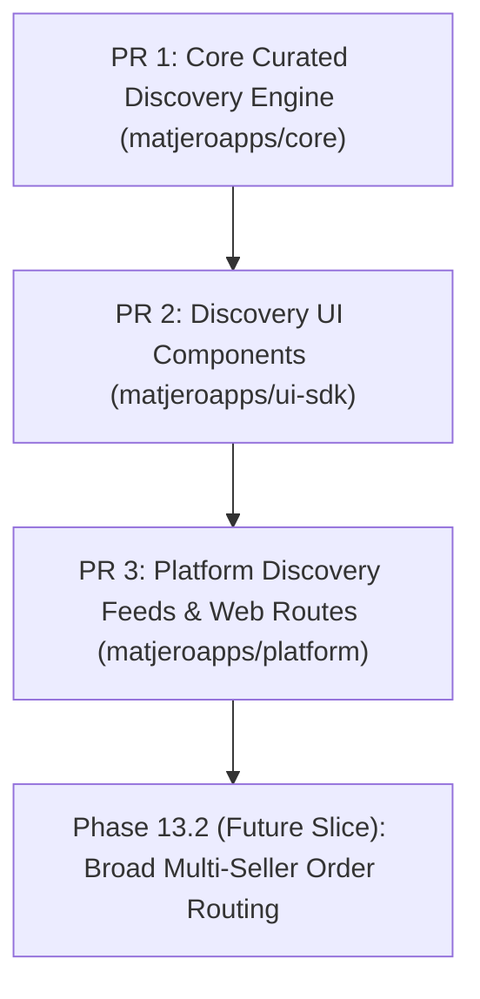

# Unified Marketplace Implementation Plan — Curated Discovery Foundation

> **Date**: 2026-09-19
> **Status**: Approved for Planning
> **Target Scope**: Curated Discovery Engine (Phase 13 — Slice A)
> **Repository**: `matjeroapps/core` (with cross-repo downstream contracts for `matjeroapps/platform`, `matjeroapps/seller`, and `matjeroapps/ui-sdk`)

---

## 1. Overview & Business Context

Following the completion of the financial rules foundation (Phase 12), balance projections, settlement calculations, and public integration APIs, this plan establishes the architecture and implementation roadmap for the **Unified Marketplace**.

Per Section 66 of [`master-plan.md`](file:///Users/zidan/www/personal/Matjerhub/core/docs/plans/master-plan.md#L2675-L2692), the platform must **not** build a broad consumer marketplace or multi-seller order routing system before sufficient curated supply and seller activity exist.

This phase focuses exclusively on **Curated Discovery** across six core product discovery buckets:
1. **Trending**: Listings with high recent customer engagement and sales velocity.
2. **Best Sellers**: Top listings by aggregate delivered volume per market.
3. **Unique Products**: Exclusive seller/artisan products not broadly available.
4. **New Products**: Recently published active seller listings.
5. **Offers**: Active listings with promotional pricing or discounts.
6. **Fast Delivery**: Listings backed by high-SLA local market fulfillment locations.

---

## 2. Explicit Non-Goals & Scope Boundaries

To prevent premature architectural complexity, the following capabilities are explicitly **excluded** from this initial implementation slice:

* ❌ **Broad Marketplace Order Routing**: Multi-seller cart aggregation and multi-merchant order splitting during checkout.
* ❌ **Marketplace Commission Processing**: Automatic commission split calculations during checkout/settlement (handled in subsequent Phase 13 slices once order routing is enabled).
* ❌ **Cross-Border Discovery**: Cross-market product exposure (all discovery remains strictly scoped to a single `market_code`).
* ❌ **Real-Time Recommendation ML/AI**: Machine learning models or non-deterministic recommendation engines (discovery uses deterministic PostgreSQL read-models).

---

## 3. Repository & Module Ownership

MatjerHub multi-repository boundaries are strictly enforced:

```text
                                  ┌───────────────────────────┐
                                  │   matjeroapps/platform    │
                                  │ (Next.js Public Web App)  │
                                  └─────────────┬─────────────┘
                                                │ HTTP REST / Server-to-Server
                                                ▼
┌──────────────────────────┐      ┌───────────────────────────┐
│   matjeroapps/ui-sdk     │◄──── │    matjeroapps/core      │
│ (Shared Discovery Cards, │      │ (Marketplace Domain &     │
│   Badges, UI Tokens)     │      │   Curated Read-Models)    │
└──────────────────────────┘      └───────────────────────────┘
```

### 1. Core (`matjeroapps/core`) — Go Domain Core
- **Domain Package**: `internal/marketplace/`
  - `domain.go`: Curated collection types, query options, collection item DTOs.
  - `read_model.go`: Optimized PostgreSQL read-model queries for curated collections.
  - `repository.go`: Database operations with `pgx.Tx` / pool integration.
  - `service.go`: Business logic, market isolation checks, i18n locale fallback handling.
  - `errors.go`: Domain error definitions.
- **Internal API**: `internal/coreapi/`
  - Mounts `/internal/v1/markets/{market_code}/marketplace/collections` endpoints.
- **Event Contracts**: `packages/events/marketplace.go`
  - Outbox event contracts for marketplace index refresh notifications.
- **Migrations**: `migrations/000032_create_marketplace_curated_discovery_schema.up.sql` (and `.down.sql`).

### 2. UI SDK (`matjeroapps/ui-sdk`) — Shared UI Components
- Shared discovery components: Product discovery cards, status badges ("Trending", "Fast Delivery", "Offer", "Unique"), responsive grid containers, and price display tokens.
- Native RTL/LTR support for Arabic (`ar`) and English (`en`).

### 3. Platform (`matjeroapps/platform`) — Next.js Consumer App
- Consumer discovery page routes: `/marketplace` and `/marketplace/collections/[type]`.
- SSR/ISR data fetching from Core API using authenticated server-to-server credentials.

### 4. Seller (`matjeroapps/seller`) — Seller Management Portal
- Read-only `coreclient` additions to retrieve discovery status and badges for seller-managed listings.

---

## 4. Data Model, Read-Model & API Boundaries

### Data Model & Read-Model Strategy
Curated discovery queries aggregate across `seller_listings`, `products`, `product_translations`, `seller_listing_prices`, `order_items`, and `fulfillment_locations`.

To ensure low-latency responses without heavy runtime joins, Phase 13 introduces a dedicated read-model table:

```sql
CREATE TABLE IF NOT EXISTS marketplace_listing_metrics (
    seller_listing_id UUID PRIMARY KEY REFERENCES seller_listings(id) ON DELETE CASCADE,
    market_code CHAR(2) NOT NULL REFERENCES markets(code),
    sales_count_30d BIGINT NOT NULL DEFAULT 0,
    delivered_count_total BIGINT NOT NULL DEFAULT 0,
    is_unique BOOLEAN NOT NULL DEFAULT false,
    is_fast_delivery BOOLEAN NOT NULL DEFAULT false,
    discount_percentage NUMERIC(5, 2) DEFAULT 0.00,
    updated_at TIMESTAMPTZ NOT NULL DEFAULT now()
);

CREATE INDEX IF NOT EXISTS idx_marketplace_metrics_market_trending
    ON marketplace_listing_metrics (market_code, sales_count_30d DESC);

CREATE INDEX IF NOT EXISTS idx_marketplace_metrics_market_bestsellers
    ON marketplace_listing_metrics (market_code, delivered_count_total DESC);
```

### Domain Rules & Invariants
1. **Strict Market Isolation**: Every discovery query is bounded by `market_code` (`EG`, `SA`, `AE`). Database indexes enforce market partitioning.
2. **Localization Resolution**: Content is fetched with preferred `locale` (`ar` default, `en` fallback) via `product_translations` and `category_translations`.
3. **Data Integrity**: Core is the sole authority for discovery metrics; external services cannot write to metric tables directly.

### Internal API Contract
```http
GET /internal/v1/markets/{market_code}/marketplace/collections/{collection_type}?locale=ar&limit=20&cursor=xxx
X-Caller-ID: platform-service
```

**Collection Types**:
- `trending`
- `best_sellers`
- `unique_products`
- `new_products`
- `offers`
- `fast_delivery`

**Response Payload Structure**:
```json
{
  "collection_type": "trending",
  "market_code": "EG",
  "items": [
    {
      "listing_id": "uuid",
      "product_id": "uuid",
      "store_id": "uuid",
      "store_name": "Artisan Coffee",
      "title": "ماكينة إسبريسو احترافية",
      "slug": "pro-espresso-maker",
      "price": {
        "amount_minor": 150000,
        "currency": "EGP"
      },
      "primary_image_uri": "https://storage.matjerhub.com/media/espresso.jpg",
      "badges": ["TRENDING", "FAST_DELIVERY"],
      "availability": "IN_STOCK"
    }
  ],
  "next_cursor": "eyJpZCI6...="
}
```

---

## 5. First Safe Implementation Slice

**Slice Name**: Core Discovery Engine & Read-Models
**Target Repository**: `matjeroapps/core`

### Execution Steps:
1. Create DB migration `migrations/000032_create_marketplace_curated_discovery_schema.up.sql` (and `.down.sql`).
2. Implement domain logic in `internal/marketplace/`.
3. Mount API handlers in `internal/coreapi/marketplace.go` behind `service-auth` middleware.
4. Define outbox event `marketplace.discovery.refreshed.v1` in `packages/events/marketplace.go`.
5. Update OpenAPI spec in `docs/api/internal/openapi.json`.
6. Add unit and integration test suites.

---

## 6. Local Validation Commands

Validation must follow mandatory guidelines in [`matjerhub-engineering-workflow`](file:///Users/zidan/www/personal/Matjerhub/.agents/skill/matjerhub-engineering-workflow/SKILL.md):

### 1. Shared Infrastructure
```bash
cd platform-infra
make up-infra
make ps
```

### 2. Core Go Validation (`matjeroapps/core`)
```bash
cd core
gofmt -s -w .
go vet ./...
go test ./...
go run ./cmd/openapi-gen
```

### 3. UI SDK Validation (`matjeroapps/ui-sdk`)
```bash
cd ui-sdk
npm run lint
npm run typecheck
npm run test
npm run build
```

### 4. Platform Application Validation (`matjeroapps/platform`)
```bash
cd platform
npm run lint
npm run typecheck
npm run test
npm run build
```

---

## 7. Implementation Report Path

Upon implementation, the detailed technical report will be placed at:
`docs/implementation/phase-13-curated-marketplace-discovery-report.md`

---

## 8. PR Sequencing (Sequential Execution)

Parallel workers are prohibited. Work proceeds in strict sequence:



1. **PR 1 (`matjeroapps/core`)**: Migration `000032`, `internal/marketplace` package, `internal/coreapi` handlers, OpenAPI specification update, full unit/integration test suite.
2. **PR 2 (`matjeroapps/ui-sdk`)**: Shared discovery card, badge components, responsive grid layouts, and RTL styling.
3. **PR 3 (`matjeroapps/platform`)**: Platform backend API integration, discovery landing pages (`/marketplace` & collection detail routes), SSR/ISR rendering.

---

## 9. Acceptance Evidence

The implementation slice is considered complete when:
- [ ] DB migration `000032` applies and rolls back cleanly without errors.
- [ ] Go unit and integration tests pass with 100% success (`go test ./...`).
- [ ] Database-enforced and code-enforced market isolation verifies zero cross-market data leaks.
- [ ] `go run ./cmd/openapi-gen` generates clean, valid OpenAPI schemas in `docs/api/internal/openapi.json`.
- [ ] UI SDK builds cleanly (`npm run build`) and renders discovery cards in Arabic (RTL) and English (LTR).
- [ ] Platform app builds (`npm run build`) with zero lint or type errors.
- [ ] Strict phase-name leakage audit passes (no phase metadata in table names, routes, code, or logs).
